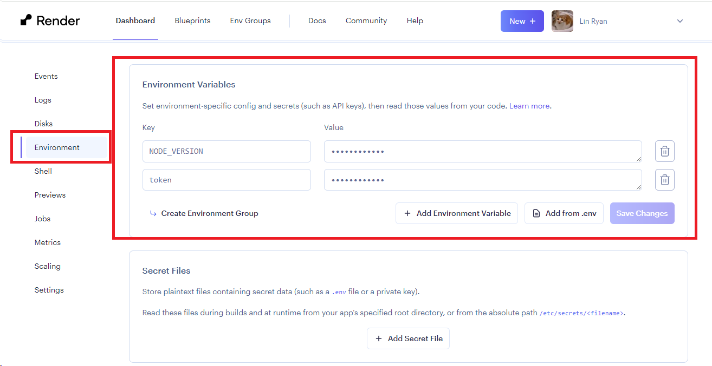
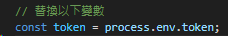

## 取得Discord Bot的Token 

- 要去Discord Developer Portal-> Application->Bot  
要再重新Reset token。

## 取得Discord Bot 主動發送訊息的channel Id

- 網路上的文章都說要copyId, 但那個要去discord的個人設定， advance調成開發者模式
太麻煩了
- 其實瀏覽器的的url, channels下的那個數字就是channel ID
- 這邊請用 1175711219064250430 (基本上不太可能去改了)

## Discord Bot 本地端建置 (測試用)
- 為測試方便, Discord Bot可以在本地上跑來測試，相當方便。
- Discord Bot的部分，可以在本地跑一下GitHub (注意, 是Github喔)
這個[專案](https://github.com/SlowMiew/DiscordBot)這個鏈結。

- 他裡面有一個資料夾叫做參考code裡面有一個 **"discord.js 使用nodejs 撰寫bot.js"**

- 這個js可以單獨執行, 把裡面的**token**跟**channel Id**更新一下就好 (這不可能放網路吧, 太危險了)

- 把專案的package.json複製過去.然後在該目錄下按npm intall就安裝相依姓
接著跑 node index.js 就可以執行

這個範例展示了:
1. 透過JS 函式庫指定id發送訊息
2. 使用axios來呼叫api
3. 怎麼取得使用者的訊息,並做出回應

## Render 指定 NodeJs的版本
- 這邊採用最簡單的方法, 到Render的[後台](https://dashboard.render.com/web/srv-clcdj43mot1c73dfblk0/env), 進入到enviorment, 然後環境變數加一個
NODE_VERSION 並指定node js的版本即可，如下圖所演示

## 怎麼在程式碼中使用Render的env檔案存放的token
- 簡單一點的就跟指定node js版本的方法一樣, 到Render的[後台](https://dashboard.render.com/web/srv-clcdj43mot1c73dfblk0/env), 進入到enviorment, 然後環境變數加一個token並指定token的值即可，
NODE_VERSION 並指定node js的版本即可，如下圖所演示

程式碼要引用的話, 用process.env.token 去assian就可以

## 更新/上傳 bot的程式碼
 - 可以用f9的帳號, 去更新[gitlab](https://gitlab.com/saberumaiden/Discord-Bot/-/blob/main/index.js?ref_type=heads) 這之前設定好的

 - **千千萬萬注意不要上傳有token的code**

## Render使用Sqlite
- 除了一開始以外, 後續能不覆蓋就不覆蓋, 不然資料會不見。
- 可以參考這個[範例](https://github.com/SlowMiew/DiscordBot/blob/main/%E5%8F%83%E8%80%83code/%E7%B0%A1%E6%98%93%E6%B8%AC%E8%A9%A6sqlite3%E6%98%AF%E5%90%A6%E8%83%BD%E7%94%A8.js), 在使用 https://saberumaiden.onrender.com/api/data 這個api去測試
- 使用上相當簡單, 只要路徑對即可。其他使用上就跟在本地端測試一樣。
